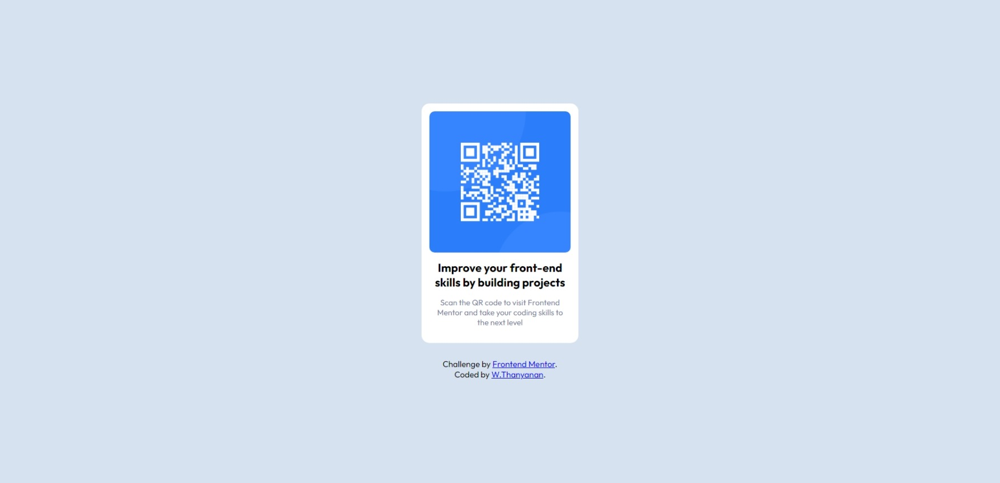
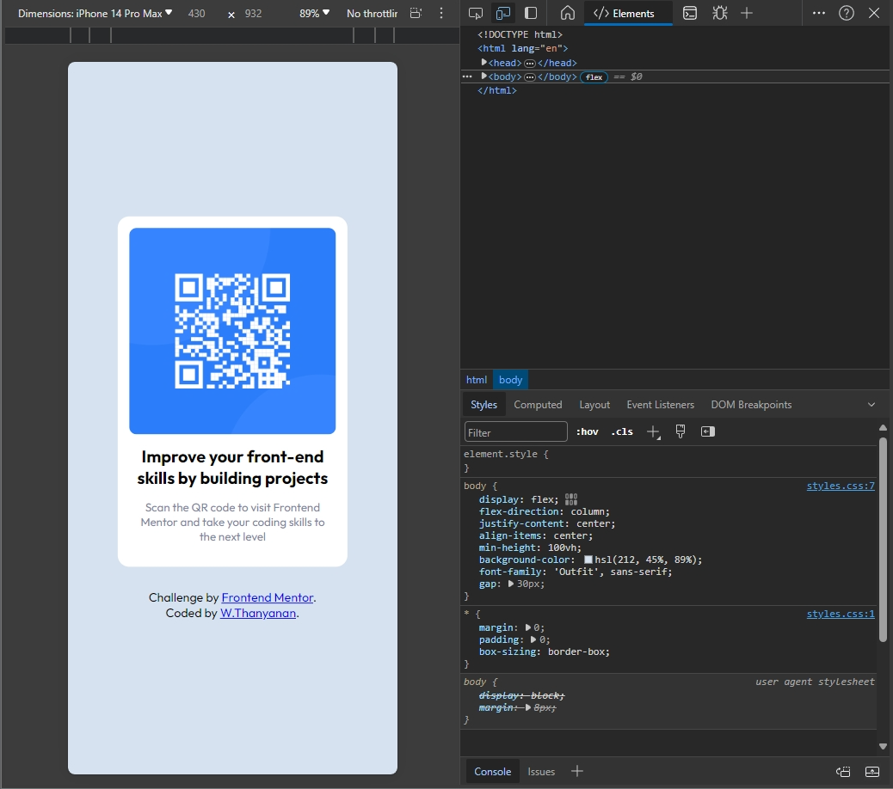

# Frontend Mentor - QR code component solution

This is a solution to the [QR code component challenge on Frontend Mentor](https://www.frontendmentor.io/challenges/qr-code-component-iux_sIO_H). Frontend Mentor challenges help you improve your coding skills by building realistic projects.

## Table of contents

- [Overview](#overview)
  - [Screenshot](#screenshot)
  - [Links](#links)
- [My process](#my-process)
  - [Built with](#built-with)
- [Author](#author)

## Overview

### Screenshot

Desktop Design

Mobile Design

### Links

- Solution URL: [Add solution URL here](https://www.frontendmentor.io/solutions/qr-code-component-using-css-basic-and-flex-tDfqGTPKdU)
- Live Site URL: [Add live site URL here](https://nobileth.github.io/QR-code-component-using-Css-Flex/)

## My process

### Built with

- Semantic HTML5 markup
- CSS properties
- Flexbox

## Author

- Frontend Mentor - [@NobileTH](https://www.frontendmentor.io/profile/NobileTH)
